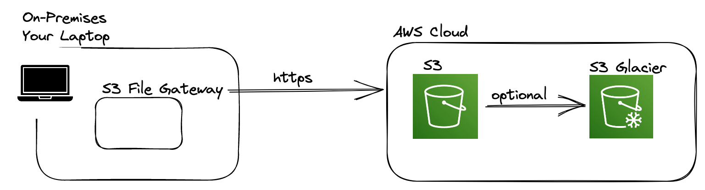
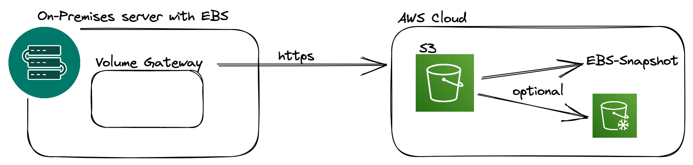

# AWS Storage Gateways

AWS means under the word "Storage Gateway" to establish a gateway between your on-premises location and AWS Cloud to transfer or backup file system data or any data for S3 (backup, archiving) to the AWS Cloud.

Hint: Storage Gateway is a high level word for the following types of storage gateways.

## S3 File Gateway
Transfer data to S3 with Storage Gateway S3 File Gateway via HTTPS.
For backup/archive data in S3 use S3 Glacier, Glacier is much cheaper than normal S3 storages.
You need to have S3 File Gateway software installed on your on-premises server or Laptop.

### Pro
- Using NFS and SMB protocol.
- Supports transfer to S3 Standard, S3 Standard-IA, S3 One Zone-IA, S3 Intelligent Tiering.
- If you want to transfer data to S3 Glacier for deep archive (backup) use "Lifecycle policy" to move data from S3 .... to S3 Glacier classes.
- S3 access using IAM roles.

### Contra
- Supports not to move data directly to Glacier but don´t worry you can use a Lifecycle policy.

### Use Cases
- Transfer data from on-premises to S3 obviously.

## FSx File Gateway
Transfer on-premises file system data to AWS Cloud AWS FSx.
You need to have FSx File Gateway software installed on your on-premises server or Laptop.
IMPORTANT: This is only for Windows.

### Pro - Use Cases
- Useful for group file shares and home directories.
- Transfer data from Windows to AWS Cloud FSx compatible with SMB, NTFS, Active Directory.  

## Volume Gateway
Transfer EBS Storage data to AWS Cloud S3 bucket.
You need to have Volume Gateway software installed on your on-premises server or Laptop.

### Pro - Use Cases
- Block storage using iSCSI protocol.
- Transfer EBS Storage data to AWS Cloud via HTTPS to S3 and optionally to AWS EBS Snapshots or Glacier.
- Keep in mind you need a Lifecycle policy to transfer data from S3 to S3 Glacier.

## Tape Gateway

## DataSync
Transfer EFS data