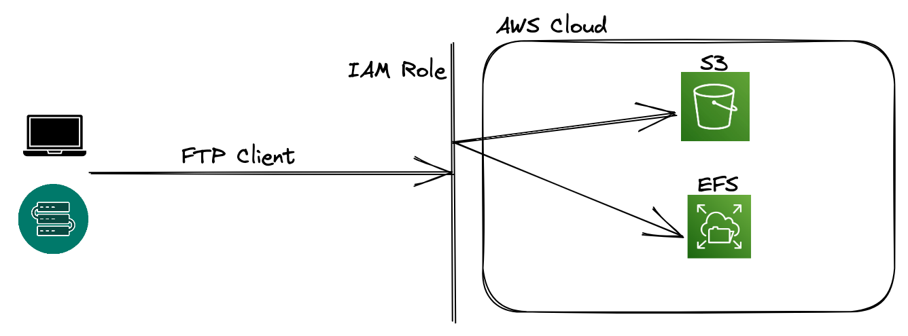
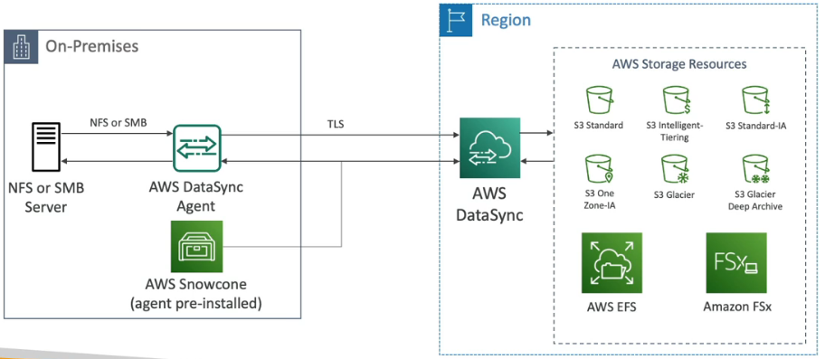
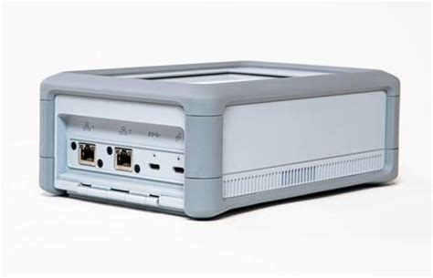
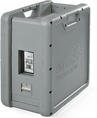

# AWS Storage Gateways

AWS means under the word "Storage Gateway" to establish a gateway between your on-premises location and AWS Cloud to transfer or backup file system data or any data for S3 (backup, archiving) to the AWS Cloud.

Hint: Storage Gateway is a high level word for the following types of storage gateways.

---
 

## S3 File Gateway
Transfer data to S3 with Storage Gateway S3 File Gateway via HTTPS.
For backup/archive data in S3 use S3 Glacier, Glacier is much cheaper than normal S3 storages.
You need to have S3 File Gateway software installed on your on-premises server or Laptop.

### Pro
- Using NFS and SMB protocol.
- Supports transfer to S3 Standard, S3 Standard-IA, S3 One Zone-IA, S3 Intelligent Tiering.
- If you want to transfer data to S3 Glacier for deep archive (backup) use "Lifecycle policy" to move data from S3 .... to S3 Glacier classes.
- S3 access using IAM roles.

### Contra
- Supports not to move data directly to Glacier but don´t worry you can use a Lifecycle policy.

### Use Cases
- Transfer data from on-premises to S3 obviously.

---
 

## FSx File Gateway
Transfer on-premises file system data to AWS Cloud AWS FSx.
You need to have FSx File Gateway software installed on your on-premises server or Laptop.
IMPORTANT: This is only for Windows.

### Pro - Use Cases
- Useful for group file shares and home directories.
- Transfer data from Windows to AWS Cloud FSx compatible with SMB, NTFS, Active Directory.

<strong>Be careful, the FSx File Gateway is only for Windows, this is not used to transfer data to FSx Lustre. This is very confusing if you see this for the first time.</strong>

---
 

## Volume Gateway
Transfer EBS Storage data to AWS Cloud S3 bucket.
You need to have Volume Gateway software installed on your on-premises server or Laptop.

### Pro - Use Cases
- Block storage using iSCSI protocol.
- Transfer EBS Storage data to AWS Cloud via HTTPS to S3 and optionally to AWS EBS Snapshots or Glacier.
- Keep in mind you need a Lifecycle policy to transfer data from S3 to S3 Glacier.

---
 

## Tape Gateway
Transfer on-premises backup data to AWS Cloud for archiving.
You need to have Tape Gateway software installed on your on-premises server or Laptop.

### Pro
- Working with leading backup software vendors.
- Virtual Tape Library backed by S3 and S3 Glacier.
- iSCSI interface.

---
 

## Transfer Family
Transfer data into and out to EFS via SFTP, FTPS or FTP.
Transfer data into S3 via SFTP, FTPS or FTP.
You need to have FTP Client software installed on your on-premises server or Laptop.

### Pro
- Assign IAM Roles to the users which accessing the S3 or EFS.

---
 

## DataSync
Data Transfer.
You need to have DataSync Agent software installed on your on-premises server or Laptop.
If you use AWS Snowcone, DataSync Agent is pre installed.

### Pro - Use Cases
- DataSync is made to transfer data from on-premises to AWS Cloud EFS, FSx, S3 all or 
- It is also made to transfer data from any Cloud to AWS Cloud for example GoogleCloud -> AWS Cloud or
- It is also made to transfer send data within the AWS Cloud, no DataSync Agent needed.
- Using NFS or SMB protocol.
- Opportunity to use AWS Snowcone. 
- Transfer EFS data. FSx Lustre etc.

---
 

## AWS Snow Family
The idea is to order physical devices from AWS and transfer your on-premises data offline on the Snow Family devices like Snowcone or Snowball. 
 
Snowcone can also be used for military purposes to put it on a drone or a soldier can easily carry the Snowcone device. Snowcone can be shipped back to AWS and AWS transferring your data to S3 or via DataSync, DataSync is only working with Snowcone the smallest device of the Snow Family.
  
The Snowball is a much bigger device and can be not used with DataSync, you have to send back the device to AWS. AWS will transfer your data from the Snowball device to S3.
  
When you ordering Snowmobile, a fucking truck will come to your home and transferring the data offline from your on-premises data center to the truck (truck has the hardware). When the truck is back in a AWS data center, the data will be transferred to S3.
  
Use one of the AWS Snow Family if you have large amount of data, if you have not enough bandwidth or you are in remote areas without or not enough internet connection.
  
Can also be used for migration, but for migration see "DatabaseMigration".

---
 

## Snowcone From AWS Snow Family
Snowcone, smallest and handiest Snow Family device.

### Pro
- Data can be sent back via DataSync online.
- Easy to carry - 2,1kg.
- 8TB of HDD or 14TB of SSD
- Offline data transfer.
- DataSync Agent pre-installed.
- Migration up to 24TB.

---
 

## Snowball From AWS Snow Family

### Pro
- 80TB usable
- Offline data transfer.
- Migration up to petabytes.

### Contra
- Only offline. No possibility to sent back data online.

---
 

## Snowmobile From Snow 
The AWS Snowmobile is a specialized truck (yeah a fucking truck 😃) that is equipped with the necessary hardware to securely transfer and store massive amounts of data (1 petabyte) from your on-premises data center to the AWS cloud.

### Pro
- Snowmobile offers robust physical security measures, including GPS tracking, security personnel, and encryption, to ensure the safety of your data during transportation.
- Snowmobile is designed for moving data at an exabyte scale, which is significantly larger than what individual Snowball devices can handle.
- All data will be transferred to S3. 

### Contra
- Probably the most expensive short-term service of AWS.
- Of course, only offline.

---
 

## Solution Architect Summary 😍

- <b>S3 File Gateway: </b>Use S3 File Gateway to send on-premises data to AWS Cloud S3 etc.

- <b>FSx File Gateway: </b>FSx File Gateway enables you to access Amazon FSx for Windows File Server file systems over NFS or SMB and sending file storage data to AWS Cloud S3.

- <b>Volume Gateway: </b>Use Volume Gateway to transfer on-premises EBS data to AWS Cloud S3 or/and EBS Snapshots

- <b>Tape Gateway: </b>Suitable for archiving and long-term data retention by transferring on-premises backups to S3 and Glacier storage.

- <b>DataSync: </b>DataSync offers efficient and secure data transfer between on-premises storage systems and AWS services, ideal for data migration, content distribution, and data backup.

- <b>Snowcone: </b>Snowcone is a portable, handy, easy to carry device designed for edge computing and data transfer, useful in remote and disconnected environments for data collection and migration.

- <b>Snowball: </b>Snowball is a rugged device for migrating large data sets offline from on-premises to AWS, ideal for data migration, disaster recovery, and content distribution.

- <b>Snowmobile: </b> Snowmobile is a massive data transfer solution on wheels, designed for exabyte-scale data migration from on-premises to the cloud, suitable for large-scale data transfer and migration projects.
