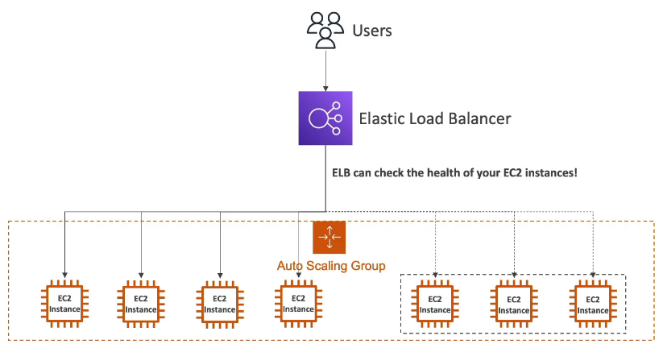
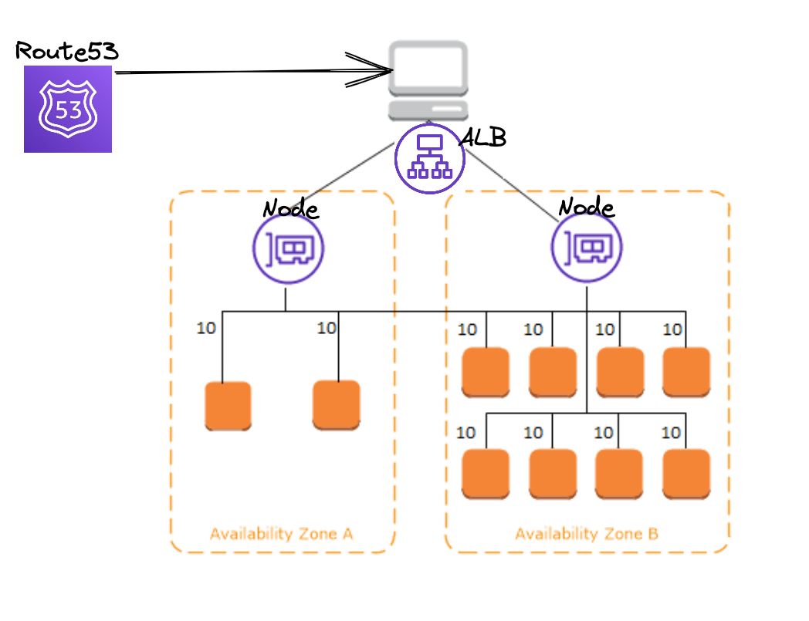
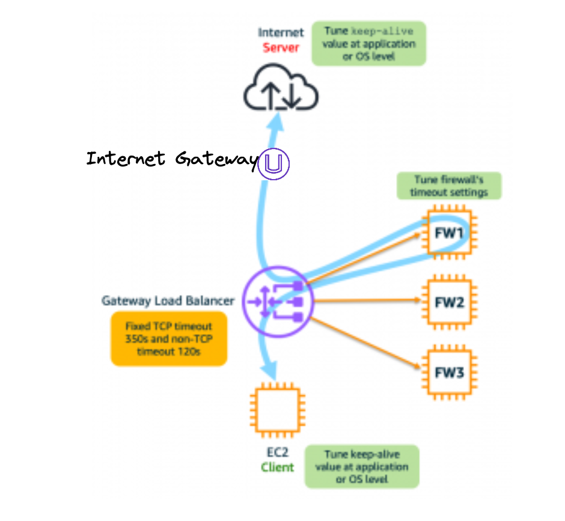
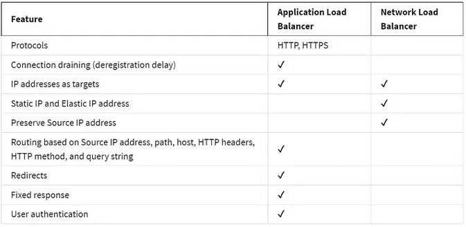
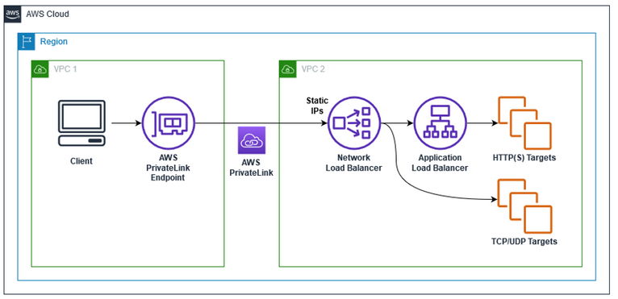

# AWS LoadBalancer & Route53 & Global Accelerator

The reason why I wrote down the description for LoadBalancers, Route53, AutoScaling and GlobalAccelerator in one is that people inclusive me were confused while learning these services completely separated to each other.
  
You have to understand the differences that you can architect different architectures based on your requirements.
 

With Application Load Balancers, Network Load Balancers, and Gateway Load Balancers, you register targets in target groups, and route traffic to the target groups

 

**Note:** I will not go to deep into these services, this is for understanding.

**Note:** Elastic Load Balancer ELB is a high level word for Application Load Balancer ALP, Network Load Balancer NLB and Gateway LOad Balancer.

___
 

## ALP Application Load Balancer
Load Balancer on application level.

ALP works with health checks to your applications. In connection with a AutoScaling Group it is possible to scale up and down based on your utilization. 

### Pro
- Load balancing to multiple HTTP applications across machines (target groups).
- Load balancing to multiple applications on the same machine (containers).
- Layer 7 (HTTP/HTTPS traffic), flexible.
- It is also possible to have a load balancer to on-premises servers or hybrid.
- ALP can be connected with AutoScalingGroup.
- Possibility to set SSL/TSL Certificate.
- Cross zone load balancing is best practice for a ALB. It is required to have atleast two AZ.
- Round Robin algorithm to route traffic. 
- IP addresses are dynamic.
- Possibility to use WAF - AWS Web Application Firewall.

### Examples

In this example you can see EC2 Instances, but it also works with container microservices.

 

In this example without AutoScaling, ALB has created so called nodes for every AZ and Route53 routes to the ALB. Cross-Zone Load Balancing must be enabled.

---
 

## NLB Network Load Balancer

### Pro
- Layer 4 (TLS/TCP/UDP traffic), static IPs.
- For TCP/UDP targets.
- Can be used with PrivateLink due to static IPs.
- Possibility to set SSL/TSL Certificate.

### Contra
- WAF - AWS Web Application Firewall cannot be used because WAf in on Layer 7 HTTP.

___
 

## Gateway Load Balancer GWLB
Gateway Load Balancer is for high security architecture. It provides a single point to enter and exit. Your traffic will be routed to firewalls before the application receiving the request. 

## Pro
- Layer 3 (Network Layer) IP packets - only private IPs.
- High security.
- Possibility to set SSL/TSL Certificate.
- Singe entry and exit point for all traffic.
- GENEVE protocol on port 6081.
- GWLB can be connected with AutoScalingGroup.
- Cross load balancing possible to enable, best practice.

---
 

## ALB vs NLB

- ALB and NLB working on different levels.
- While the Application Load Balancer(ALB) looks at the HTTP request header to determine where to route the request, the Network Load Balancer(NLB) simply forwards requests.
- Also Application Load Balancer can guarantee application availability, however Network Load Balancer cannot.
- No WAF possible.

---
 

## ALB + NLB

- You can use PrivateLink only with NLB in front of ALB, due to NLB´s static IP.
- If you have hybrid solution like HTTP and TCP you can use both ALB and NLB.
- Both can be used with AutoScalingGroup.

### Pro
- Layer 4/7 (HTTP/TCP/SSL traffic), legacy, avoid.

---
 

## Route53
For understanding, Route53 is the layer above the Load Balancers, but it is more than that, let me explain.

TODO

---
 

## Solution Architect Summary 😍

- <b>ALB (Application Load Balancer): </b>Use ALB when you need advanced routing, content-based routing, and support for HTTP/HTTPS applications with flexible routing rules.

- <b>NLB (Network Load Balancer): </b>Choose NLB for scenarios requiring high-throughput, low-latency load balancing of TCP/UDP traffic, such as gaming, IoT, and real-time communication applications.

- <b>Gateway Load Balancer: </b>Opt for Gateway Load Balancer when you want to deploy and manage third-party virtual appliances like firewalls and security devices in your VPC network traffic path. High security architectures.