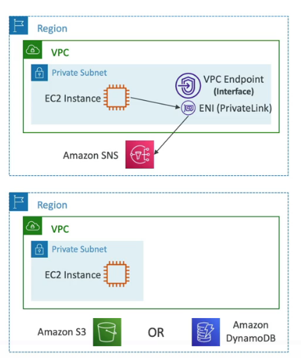
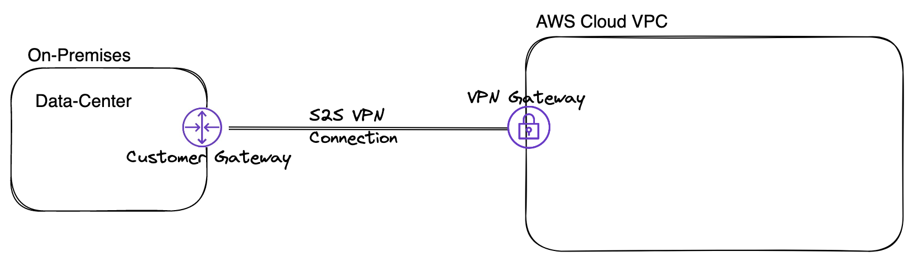
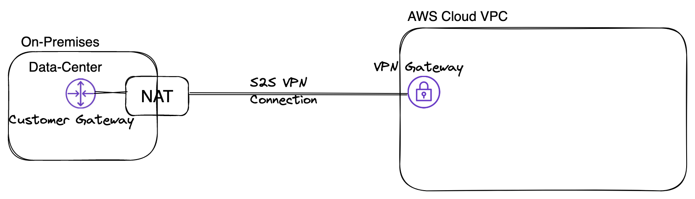
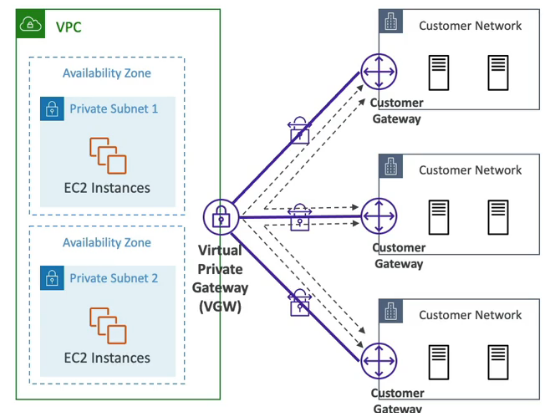
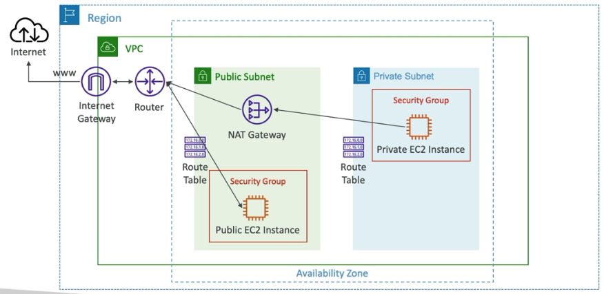

# AWS Connections

## EventBridge

Amazon EventBridge is a serverless event bus service that makes it easy to connect your applications with data from a variety of sources. EventBridge delivers a stream of real-time data from your own applications, software-as-a-service (SaaS) applications, and AWS services and routes that data to targets such as AWS Lambda. You can set up routing rules to determine where to send your data to build application architectures that react in real time to all of your data sources. EventBridge enables you to build event-driven architectures that are loosely coupled and distributed.

You almost endless possibilities with EventBridge, so you have to be creative to reach your requirements. 
Below are a few possibilities. 

## Use Cases
- Connection between applications.
- Event driven applications, event driven cloud flow.

---
 

## VPC Endpoint PrivateLink
Private connection between VPC and AWS services like Aurora, DynamoDB etc. without traversing the public internet.

### Pro
- Private network instead of going to the public internet.
- Low latency.

### Contra or Attention
Two different types of endpoints available:
1. Interface Endpoint (PrivateLink): Connection to almost all AWS services possible, but it costs a lot.
2. Gateway Endpoint: This goes not over PrivateLink and supports S3 and DynamoDB, it is completely free of costs.

---
 

## VPC Peering
A VPC peering connection is a networking connection between two VPCs that enables you to route traffic between them using private IPv4 addresses or IPv6 addresses.

### Pro
- Private connection between VPCs using AWS network.
- VPC Peering between own VPCs or VPCs in other accounts.
- VPCs can be in different regions.
- Never traverses the public internet.
- VPC peering provides a simple and cost-effective way to share resources between regions or replicate data for geographic redundancy.
- Must be established for each VPC.

## Contra
- AWS uses the existing infrastructure of a VPC to create a VPC peering connection; it is neither a gateway nor a VPN connection, and does not rely on a separate piece of physical hardware. There is no single point of failure for communication or a bandwidth bottleneck.

---
 

# Site2Site Connection
Connection between On-Premises servers or data centers and AWS Cloud VPC.
You have to enable "Route Propagation" in VPC. 
Add ICMP protocol on the inbound of security group.

### Customer Gateway - VPN Gateway / public IP
Allows you to establish a VPN connection between On-Premises servers and AWS Cloud VPC.
This is a public connection.
1. Customer Gateway
2. VPN Gateway

---

### Customer Gateway - VPN Gateway / private
Allows you to establish a VPN connection between on-premises servers and AWS Cloud VPC.
This is a private connection via NAT device at on-premises side.
1. Customer Gateway
2. VPN Gateway

---

### AWS VPN CloudHub
Connection between multiple on-premises servers or data centers and AWS Cloud VPC.
1. Customer Gateway
2. VPN Gateway

---

## Internet Gateway

---
 

## Direct Connect

---
 

## VPN Gateway

---
 

## Transit Gateway

---
 

## NAT Gateway
Opportunity to make private subnet accessible from the internet.

- It works only from subnet to subnet, you can run NAT-Gateway from public subnet and route to private subnet.

