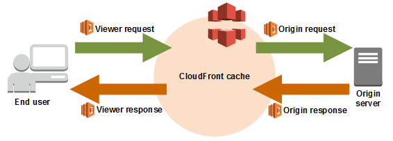

# AWS Serverless

## Elastic Beanstalk
With AWS Elastic Beanstalk, you can quickly deploy and manage applications in the AWS Cloud without worrying about the infrastructure that runs those applications.

### Pro
- You simply upload your application, and AWS Elastic Beanstalk automatically handles the details of capacity provisioning, load balancing, scaling, and application health monitoring.
- CloudFormation in the background.
- Benefits of all CloudFormation features like creation of diagrams etc.
- CloudWatch included.
- S3 for backups included.
- Use AWS Elastic Beanstalk console.
- Deploy in multiple AZ possible.

### Use Cases
- Quickly launch web applications.
- One region architecture.

---
 

## Lambda
With AWS Lambda, you can run code without provisioning or managing servers. You pay only for the compute time that you consume—there's no charge when your code isn't running. You can run code for virtually any type of application or backend service—all with zero administration. Just upload your code and Lambda takes care of everything required to run and scale your code with high availability.

### Pro
- Serverless functions.
- Edge functions.
- Cheap.
- Available for a lot od programming languages like Nodejs, Python, Java, C#, Go etc.
- Lambda runs your function in multiple Availability Zones to ensure that it is available to process events in case of a service interruption in a single zone.
- Recourses for functions up to 10GB of RAM.
- Will also improve CPU automatically.
- Use API Gateway in front of Lambda APIs to secure APIs.
- Use Lambda with multiple services.
- Lambda Container Images.

### Contra
- Don´t use Lambda when you API takes long time to process because you pay per request and execution time.

### Edge functions
Lambda@Edge is an extension of AWS Lambda that lets you deploy Python and Node.js functions at Amazon CloudFront edge locations.

### Pro
- Working with cache, much faster to bring content to end user.

---
 

## AWS Amplify
Use AWS Amplify to develop and deploy cloud-powered mobile apps and web apps.

### Pro
- Connect your code from Github for example etc.
- Amplify is the Elastic Beanstalk for mobile and web apps.
- Host frontend with Amplify like React, Vuejs, Angular etc.

---
 

## Solution Architect Summary 😍

- <b>Elastic Beanstalk: </b>Quickly launch web applications with the whole infrastructure around for example backups, scaling, load balancing etc. everything is fully managed around your application. 

- <b>Lambda: </b>Use Lambda to run code without provisioning or managing servers. Lambda is also very cheap if you have fast APIs. Use Lambda Edge with CloudFront to deliver content very fast to the end user due to caching. Use Lambda for any functions like notification etc. be creative. 

- <b>Amplify: </b>Host frontend applications like Vuejs, Reac, Nextjs etc. fully managed like Beanstalk is doing with backend applications.
