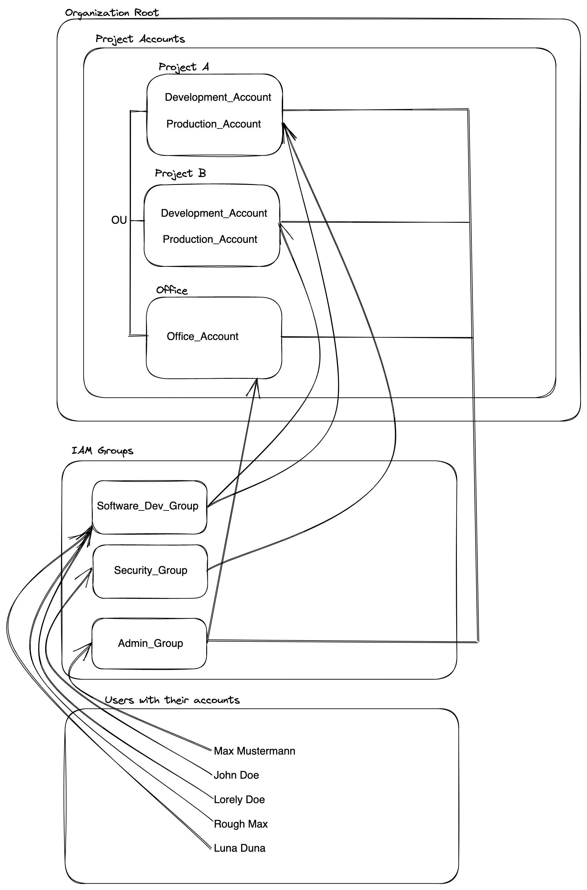

# AWS Organizations & IAM

## IAM Groups
Instead of managing every individual user, create user groups and attach users to groups. You can manage a large amount of users by just managing groups.

### Pro
- Users can be in multiple groups.
- Groups can only contain users, not other groups.
- AWS you apply least privilege principle, don´t give more permissions than needed.
- Create your users globally not in a region that the groups are available everywhere.
- Add a admin user in the account what was created, don´t use the root account to create all on top of it, create admin, group name should be admin.
- Attach multiple IAM Policies to the group.

You can attach specific IAM Policies for each user group (IAM Groups), of course the admin group needs different policies as the developers group.

---
 

## IAM Policies

### Pro
- With policies one can add specific permissions for a group, also for specific users but this is not best practice, always manage users within IAM Groups.
- Write your own policies, create policies via creator or use one of the hundreds of AWS pre created policies.

---
 

## IAM Roles

---
 

## IAM Security

---
 

## AWS Organization

