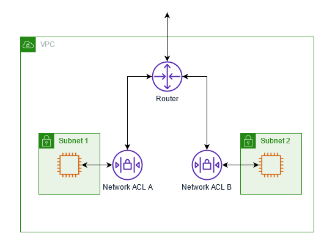
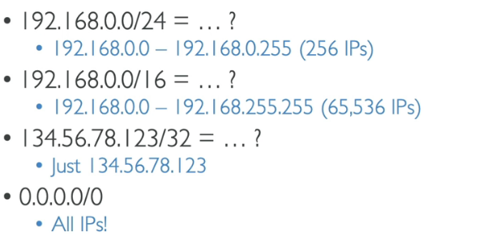
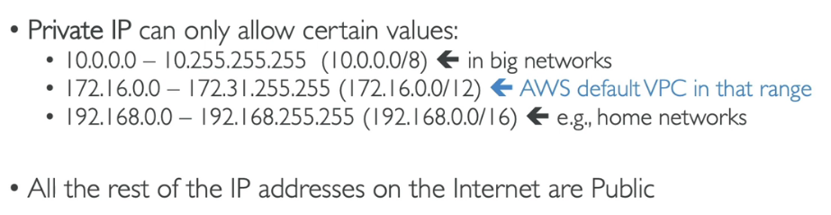

# AWS Network VPC

## AWS ACL - Network Access Control List
ACL allows or denies specific inbound or outbound traffic at the subnet level. 

### Pro
- No additional charge to use ACL.

## CIDR - Classless Inter Domain Routing
A subnet CIDR reservation is a range of IPv4 or IPv6 addresses that you set aside so that AWS can't assign them to your network interfaces. This enables you to reserve IPv4 or IPv6 CIDRs (also called "prefixes") for use with your network interfaces.

- AWS reserves 5 IP addresses in this range. They are used internally for networking and communication purposes within the AWS infrastructure.
- Helpful tool: <a href="https://www.ipaddressguide.com/cidr" target="_blank">https://www.ipaddressguide.com/cidr</a>

## Public & Private IP

